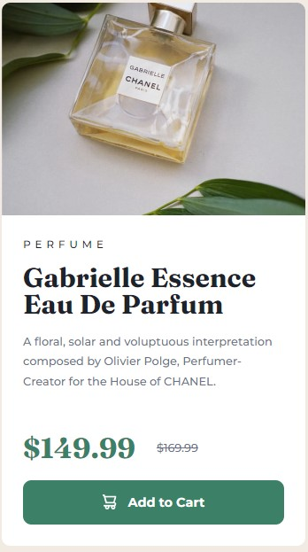

# Frontend Mentor - Product preview card component solution

This is a solution to the [Product preview card component challenge on Frontend Mentor](https://www.frontendmentor.io/challenges/product-preview-card-component-GO7UmttRfa). Frontend Mentor challenges help you improve your coding skills by building realistic projects.

## Table of contents

- [Overview](#overview)
  - [The challenge](#the-challenge)
  - [Screenshot](#screenshot)
  - [Links](#links)
- [My process](#my-process)
  - [Built with](#built-with)
  - [What I learned](#what-i-learned)
  - [Continued development](#continued-development)
  - [Useful resources](#useful-resources)
- [Author](#author)

## Overview

### The challenge

Users should be able to:

- View the optimal layout depending on their device's screen size
- See hover and focus states for interactive elements

### Screenshot

Desktop Layout


Mobile Layout



Button hover state


### Links

- Solution URL: [Frontend Mentor](https://www.frontendmentor.io/solutions/product-preview-card-using-react-and-styled-components-luxmiqqUBX)
- Live Site URL: [Github Pages](https://timmartin13-frontend-mentor.github.io/product-preview-card-component/)

## My process

### Built with

- Flexbox
- Mobile-first workflow
- [React](https://reactjs.org/) - JS library
- [Styled Components](https://styled-components.com/) - For styles

### What I learned

I learned how to use styled-components with React. To me, it makes everything a lot easier to read.

```css
export const Name = styled.h1`
  color: ${(props) => props.theme.veryDarkBlue};
  font-size: 1.9rem;
  font-family: "Fraunces", sans-serif;
  margin: 0.2rem 0;
  line-height: 1.9rem;

  @media screen and (min-width: 600px) {
    padding-bottom: 0.5rem;
    font-size: 1.95rem;
    line-height: 2rem;
  }
`;
```

### Continued development

I am going to continue to familiarize myself with React and styled-components. I want to try a tougher challenge and see if styled-components scales well.

### Useful resources

- [Hosting React on Github pages](https://www.c-sharpcorner.com/article/how-to-deploy-react-application-on-github-pages/) - This helped me to get my React app up on github pages
- [Styled-components](https://styled-components.com/docs) - Documentation for styled-components

## Author

- Website - [My portfolio](https://timmartin13.github.io/react-portfolio/)
- Frontend Mentor - [@TimMartin13](https://www.frontendmentor.io/profile/TimMartin13)
